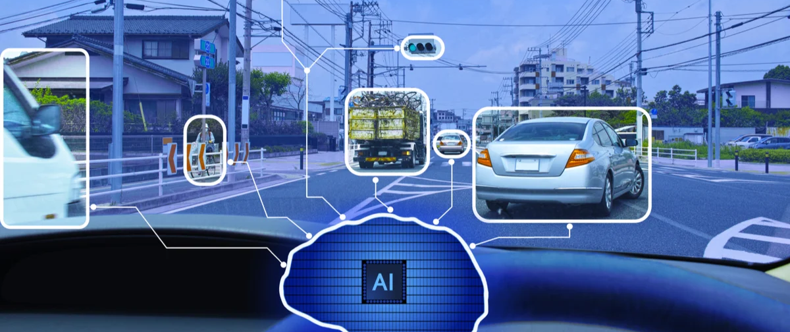
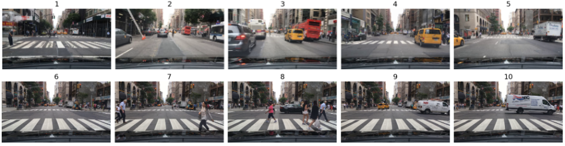
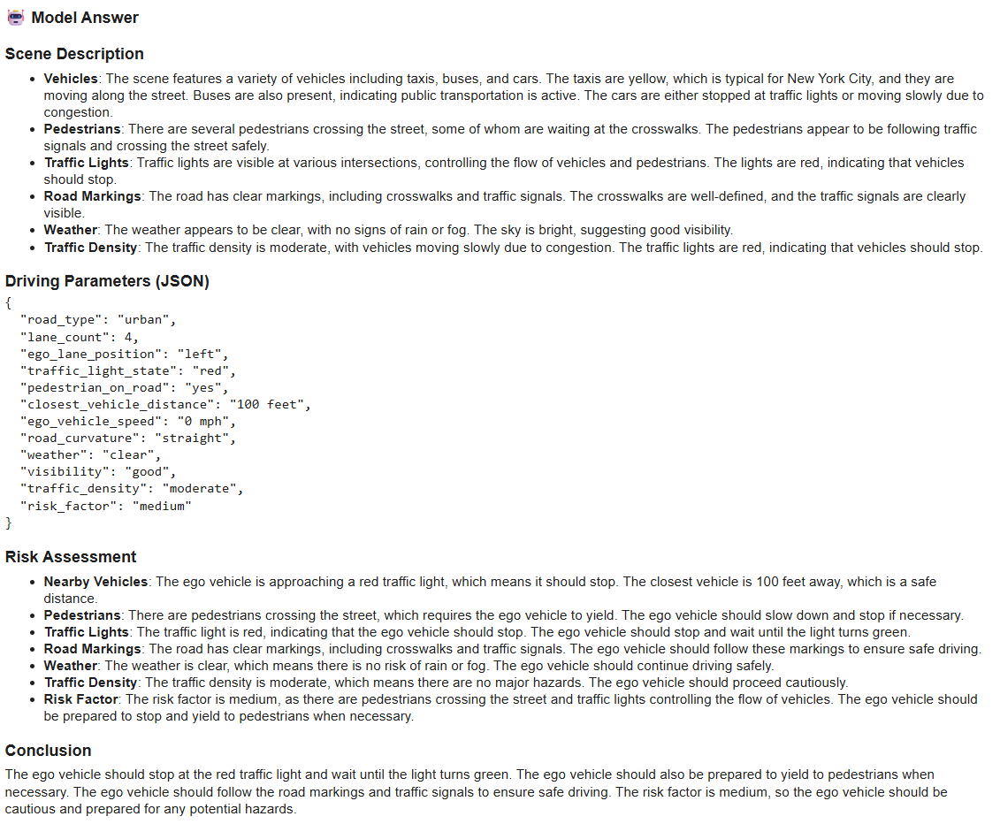
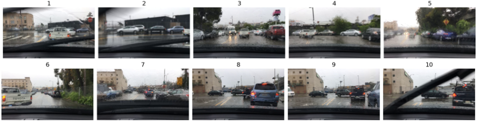
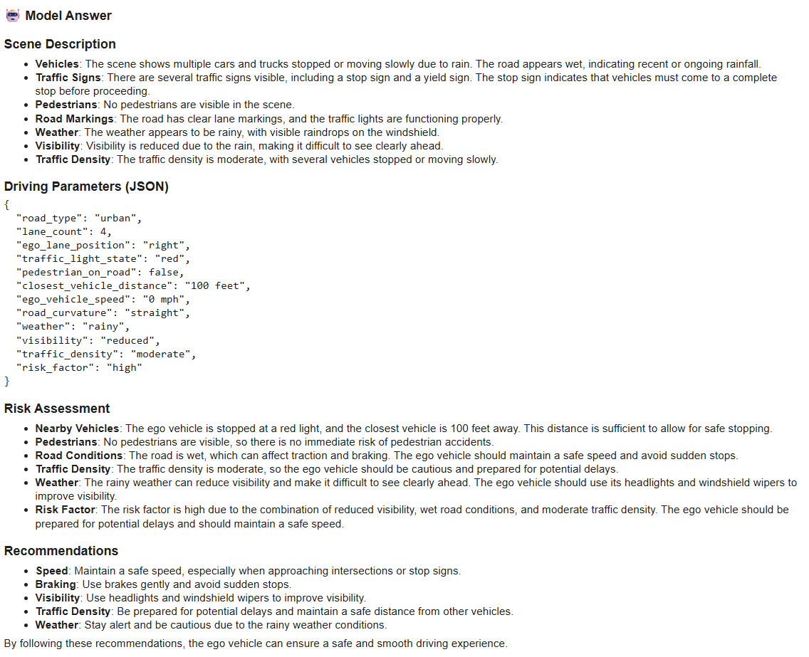
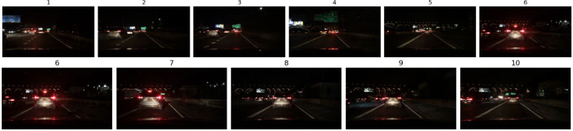

# SFT-Qwen3-Vision-Language-Assistant-for-Autonomous-Driving: Finetuning Qwen3-VL model on a custom multi-image VL dataset, using QLoRA 4-bit quantization and Transformer Reinforcement Learning

[](https://colab.research.google.com/github/SarveshBTelang/SFT-Qwen3-Vision-Language-Assistant-for-Autonomous-Driving/blob/main/SFT_VLA_colab_notebook.ipynb)

This repository contains an **end-to-end pipeline for Supervised finetuning (SFT) of Qwen3-VL Vision–Language Model (VLM)** for **ADAS and Autonomous Driving video understanding** using multi-image inputs with QLoRA, designed to run efficiently on **Google Colab free-tier (T4 GPU)**.

---
<p align="center">
  
</p>
---

## Project Overview

This work presents a computationally efficient pipeline for fine-tuning the Qwen3-VL Vision-Language model for autonomous driving perception and reasoning tasks. The project demonstrates a parameter-efficient fine-tuning technique, QLoRA with 4-bit quantization, for training multi-billion-parameter models on consumer-grade GPU hardware (Google Colab T4 GPU) without sacrificing performance. The approach processes driving videos as sequential multi-image inputs, enabling temporal reasoning while circumventing the GPU memory requirements of full video attention mechanisms. The training leverages the TRL (Transformer Reinforcement Learning) library, which provides optimized trainers for parameter-efficient methods.

The system generates structured natural language descriptions encompassing scene understanding, contextual awareness, and safety-critical risk assessments from raw driving footage. The approach is validated on the BDD100K dataset, with both the fine-tuned model and curated instruction-following dataset released to facilitate reproducible research in this domain.

For each driving video, the pipeline generates:

- Scene description
- Driving parameters
- Risk assessment
- Outputs in:
  - **Natural language**
  - **Structured JSON format**

## Results

### Checkpoints

12.2025 -->
[https://huggingface.co/SarveshBTelang/SFT_VLA_Qwen3-VL-2B-Instruct-multimage-trl](https://huggingface.co/SarveshBTelang/SFT_VLA_Qwen3-VL-2B-Instruct-multimage-trl)


### Qualitative Analysis

The model demonstrates strong performance across multiple evaluation dimensions:

| Input Frames | Model Response |
|:------------:|:--------------|
|  |  |
|  |  |
|  |  |

**Capabilities**:

- Scene understanding and object detection across temporal sequences
- Contextual awareness of traffic rules and driving norms
- Safety-critical hazard identification (pedestrians, lane changes, etc.)
- Structured output generation adhering to JSON schemas

### Computational Efficiency

(For current checkpoint)

| Metric | Value |
|--------|-------|
| Training Time | ~2-4 hours (T4 GPU) |
| Memory Footprint | <16GB VRAM |
| Inference Latency | ~60 seconds per video |
| Model Size (Base) | ~2B parameters |
| Base model parameters | ~2,127,532,032 |
| LoRA adapter params | ~34,865,152 |
| Adapter Parameters | ~1.6388% of base model |

---

### Features

- Optimized for **Google Colab free-tier T4 GPU** deployment (<16GB VRAM)
- Resource-efficient finetuning using:
  - **QLoRA (4-bit quantization)**
  - **PEFT adapters**
  - **TRL (Transformer Reinforcement Learning)**
- ~2B parameters with 1.64% LoRA adapter overhead (~35M trainable params)
- Generates outputs in natural language and structured JSON format
- Performs temporal reasoning across video frames for context-aware understanding

---
### Video Understanding Strategy

Instead of processing full video sequences (which typically require **FlashAttention 2** and **A100/Hopper GPUs**), this approach:

- Extracts a **fixed number of frames per video**
- Treats them as **sequential multi-image inputs**
- Enables **temporal reasoning** while remaining compatible with **T4 GPUs**

### Dataset

- **Hugging face link:**  
  [`SarveshBTelang/SFT_VLA_Dataset_1.0`](https://huggingface.co/datasets/SarveshBTelang/SFT_VLA_Dataset_1.0)

- **Source:**  
  Images extracted from **BDD100K driving videos**  
  http://bdd-data.berkeley.edu/

- **Structure:**
  - Multiple images per sample
  - Instruction–completion text pairs
  - Designed for **Supervised Fine-Tuning (SFT)** of VLMs using TRL

- Instructions were generated using the pipeline in [**generate_instruction_dataset.ipynb**](https://github.com/SarveshBTelang/SFT-Qwen3-Vision-Language-Assistant-for-Autonomous-Driving/blob/main/generate_instruction_dataset.ipynb)
- This notebook converts driving videos into raw instruction dataset using llm. These outputs serve as **raw instruction data** that are further cleaned, validated and refined via domain rules.
  
---

### Framework versions

- TRL: 0.26.0
- Transformers: 4.57.3
- Pytorch: 2.9.0+cu126
- Datasets: 4.4.1
- Tokenizers: 0.22.1

## Citations
    
```bibtex
@misc{vonwerra2022trl,
	title        = {{TRL: Transformer Reinforcement Learning}},
	author       = {Leandro von Werra and Younes Belkada and Lewis Tunstall and Edward Beeching and Tristan Thrush and Nathan Lambert and Shengyi Huang and Kashif Rasul and Quentin Gallou{\'e}dec},
	year         = 2020,
	journal      = {GitHub repository},
	publisher    = {GitHub},
	howpublished = {\url{https://github.com/huggingface/trl}}
}

@InProceedings{bdd100k,
    author = {Yu, Fisher and Chen, Haofeng and Wang, Xin and Xian, Wenqi and Chen, Yingying and Liu, Fangchen and Madhavan, Vashisht and Darrell, Trevor},
    title = {BDD100K: A Diverse Driving Dataset for Heterogeneous Multitask Learning},
    booktitle = {The IEEE Conference on Computer Vision and Pattern Recognition (CVPR)},
    month = {June},
    year = {2020}
}
```
- [TRL GitHub Repository](https://github.com/huggingface/trl)
- [Official TRL Examples](https://huggingface.co/docs/trl/example_overview)
- [Qwen3-VL Fine-tuning Examples](https://github.com/QwenLM/Qwen3-VL/tree/main/qwen-vl-finetune)

